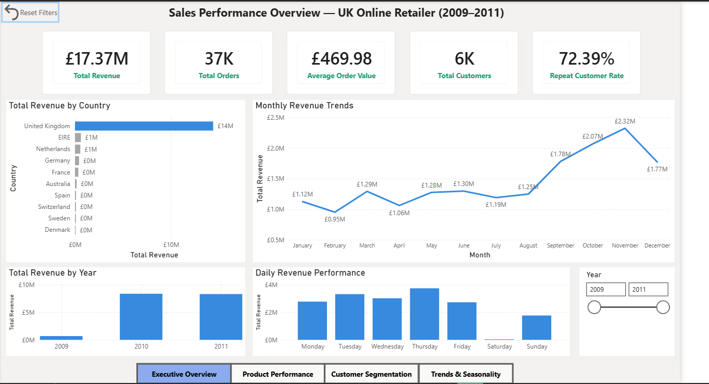
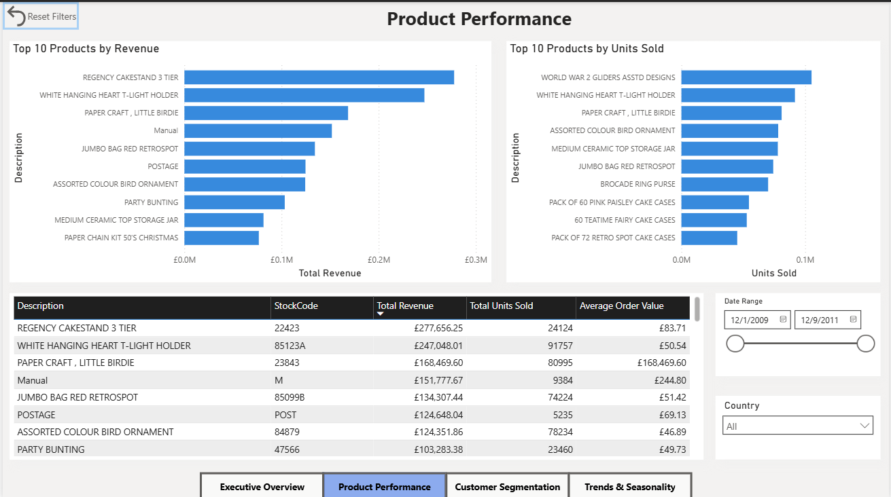
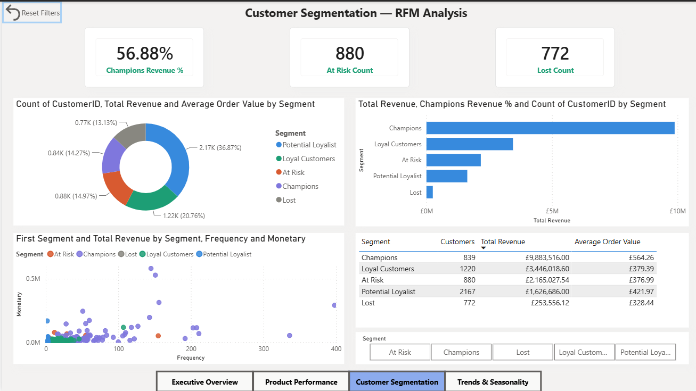
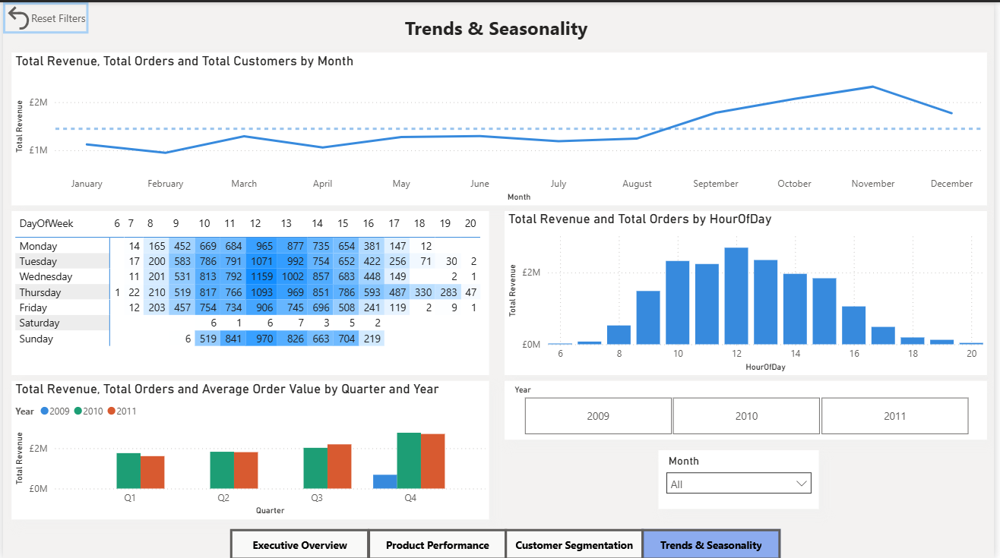

🛍️ Customer Segmentation & Sales Performance Analysis
UK Online Retailer | SQL · Python · Power BI | 2009–2011
> **End-to-end data analytics project** analyzing 1 million+ real e-commerce transactions to identify high-value customers, top-performing products, and seasonal revenue patterns — built to demonstrate a complete analyst workflow from raw messy data to business recommendation.
---
📊 Dashboard Preview
Page 1 — Executive Overview

Page 2 — Product Performance

Page 3 — Customer Segmentation (RFM Analysis)

Page 4 — Trends & Seasonality

---
🎯 Business Problem
A UK-based online retailer wanted answers to three core business questions:
Which customers drive the most revenue — and are we at risk of losing them?
Which products should we prioritize for stock, pricing, and marketing?
When and where does revenue concentrate — and how should we plan for it?
---
🔑 Key Findings
Finding	Detail
🏆 Revenue concentration	Champions segment (839 customers, 14% of base) generated £9.88M — 57% of total revenue
🔄 Customer loyalty	72.39% repeat customer rate — strong loyalty signal
📅 Q4 seasonality	November (£2.07M) and December (£2.32M) are 2× the H1 monthly average
🌍 Geographic concentration	83% of revenue from UK — EIRE and Netherlands are distant second and third
⏰ B2B buying pattern	Peak orders Thursday 10am–12pm — near-zero weekend activity confirms wholesale customer base
⚠️ At risk customers	880 customers previously bought frequently but haven't recently — immediate re-engagement opportunity
---
🛠️ Tools & Technologies
Tool	Version	Purpose
Python	3.x	Data cleaning, RFM segmentation (Pandas, NumPy)
PostgreSQL	16	Database storage and SQL business queries
SQLAlchemy	2.x	Python-to-PostgreSQL connection
Power BI Desktop	Latest	Interactive 4-page dashboard with DAX measures
Jupyter Notebook	-	Cleaning and segmentation notebooks
GitHub	-	Version control and portfolio documentation
---
📁 Repository Structure
```
retail-analytics-project/
│
├── README.md                          ← You are here
│
├── notebooks/
│   ├── 01_data_cleaning.ipynb         ← Phase 1: cleaning pipeline (Python)
│   ├── 02_load_to_sql.ipynb           ← Phase 2: loading data to PostgreSQL
│   └── 03_rfm_segmentation.ipynb      ← Phase 3: RFM model
│
├── sql/
│   ├── q1_monthly_revenue.sql         ← Monthly revenue trend
│   ├── q2_top_products.sql            ← Top 10 products by revenue
│   ├── q3_revenue_by_country.sql      ← Revenue by country
│   ├── q4_repeat_customers.sql        ← Repeat vs one-time customers
│   └── q5_avg_order_value.sql         ← Average order value by month
│
├── powerbi/
│   └── retail_dashboard.pbix          ← Power BI dashboard file
│
├── data/
│   └── cleaned/
│       ├── rfm_segments.csv           ← RFM output (5,878 customers)
│       └── README.md                  ← Download link for cleaned_retail_data.csv
│
├── reports/
│   └── findings_and_recommendations.pdf
│
└── images/
    ├── page1_executive_overview.png
    ├── page2_product_performance.png
    ├── page3_customer_segmentation.png
    └── page4_trends_seasonality.png
```
---
📋 Project Pipeline
Phase 1 — Data Cleaning (Python/Pandas)
Notebook: `notebooks/01_data_cleaning.ipynb`
Raw dataset: 1,067,371 rows with multiple quality issues.
Issue	Rows affected	Action taken
Missing CustomerID	~243,000 (23%)	Dropped — cannot segment unknown customers
Cancelled orders (Invoice starts with C)	~9,288	Filtered out — not completed sales
Negative quantity (returns)	Several thousand	Filtered (Quantity > 0)
Zero or negative price	Several hundred	Filtered (UnitPrice > 0)
Exact duplicate rows	Some	Removed with drop_duplicates()
Result: 779,425 clean rows ready for SQL and Power BI.
Also created:
`TotalPrice` column (Quantity × UnitPrice) — used in all revenue calculations
Renamed columns to standard names (`Invoice → InvoiceNo`, `Price → UnitPrice`, `Customer ID → CustomerID`)
---
Phase 2 — SQL Analysis (PostgreSQL)
Notebook: `notebooks/02_load_to_sql.ipynb` | Queries: `sql/` folder
Loaded cleaned data into PostgreSQL and wrote 5 business queries:
Query	Business question
Monthly revenue trend	Is revenue growing? When does it peak?
Top 10 products by revenue	Which products drive the most money?
Revenue by country	Where are customers geographically concentrated?
Repeat vs one-time customers	What share of customers ever came back?
Average order value by month	How much does a customer spend per visit over time?
Notable SQL technique: Query 5 uses a subquery to collapse multiple product line rows into true order totals before averaging — without this, the result would reflect individual line items rather than complete orders.
---
Phase 3 — RFM Customer Segmentation (Python)
Notebook: `notebooks/03_rfm_segmentation.ipynb`
Built an RFM (Recency, Frequency, Monetary) model segmenting all 5,878 customers:
Segment	Customers	% of base	Revenue	% of revenue
Champions	839	14.3%	£9,883,516	56.9%
Loyal Customers	1,220	20.8%	£3,446,019	19.8%
At Risk	880	15.0%	£2,165,028	12.5%
Potential Loyalist	2,167	36.9%	£1,626,686	9.4%
Lost	772	13.1%	£253,556	1.5%
---
Phase 4 — Power BI Dashboard
File: `powerbi/retail_dashboard.pbix`
4-page interactive dashboard with DAX measures, cross-filtering slicers,
navigation buttons, reset bookmarks, conditional formatting heatmap, and custom tooltips.
Page	Key visuals
Executive Overview	5 KPI cards, monthly revenue line, country bar, YoY comparison, day-of-week chart
Product Performance	Top 10 by revenue, top 10 by units, product detail table with slicers
Customer Segmentation	RFM donut, revenue by segment bar, scatter plot, segment summary table
Trends & Seasonality	Monthly trend + average line, hour-of-day chart, day/hour heatmap, quarterly YoY
---
💡 Business Recommendations
1. Protect Champions — prioritize retention over acquisition
Losing 10% of Champions removes ~£988K annually. Implement a loyalty program for this segment before spending on new customer acquisition.
2. Plan for Q4 — build inventory in September
November and December generate more than double the H1 monthly average. Inventory and staffing increases should begin in September.
3. Re-engage At Risk customers immediately
880 customers previously bought frequently but haven't recently. A targeted win-back campaign before they become Lost is far more cost-effective than acquiring new customers.
4. Eliminate weekend marketing spend
Saturday generated only 30 orders across the entire 2-year dataset. Redirect budget to Thursday morning campaigns when ordering peaks.
5. Evaluate international expansion
EIRE and Netherlands show £0.6M revenue each — likely with zero targeted marketing. Small localization investment could yield disproportionate returns.
---
📂 Dataset
Online Retail II (UCI)
Source: Kaggle
Size: 1,067,371 transactions | December 2009 – December 2011 | 38+ countries
Note: Many customers are wholesale buyers, explaining the high AOV (£469.98)
> `cleaned_retail_data.csv` is not stored here due to file size (~55MB).
> See `data/cleaned/README.md` for download instructions.
---
🚀 How to Reproduce
```bash
# 1. Clone this repository
git clone https://github.com/YOUR_USERNAME/retail-analytics-project.git

# 2. Install Python dependencies
pip install pandas numpy sqlalchemy psycopg2-binary jupyter

# 3. Download dataset from Kaggle
# https://www.kaggle.com/datasets/mashlyn/online-retail-ii-uci

# 4. Run notebooks in order
# → 01_data_cleaning.ipynb
# → 02_load_to_sql.ipynb
# → 03_rfm_segmentation.ipynb

# 5. Open Power BI file
# → powerbi/retail_dashboard.pbix
```
---
👤 About
Md. Jubayer — Data Analyst
Currently seeking Data Analyst opportunities in Germany (Chancenkarte pathway)


---
Built with real transactional data. All analysis for portfolio demonstration purposes.
